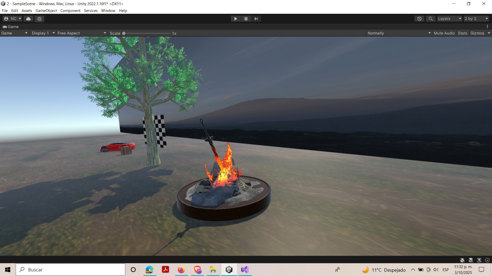
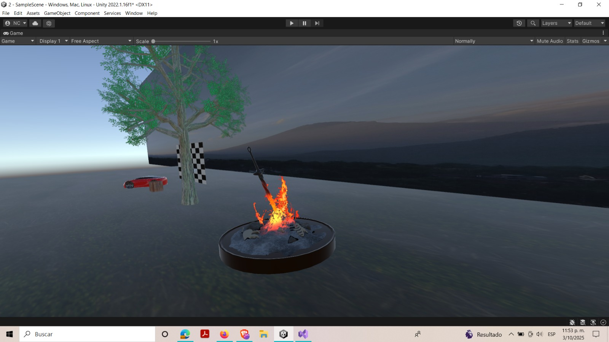

# 🌍 Escenario 3D – Proyecto Three.js Editor

## 📝 Concepto General
Este escenario representa la comparación de tres tipo de objetos físicos de distinta naturaleza **[Auto, Árbol y una Fogata]**.  
La escena busca transmitir los objetos, combinando iluminación realista con materiales PBR y ambientación día/noche.

---

## 🧱 Modelos GLB Usados

| Nombre del Modelo | Modificaciones Realizadas |
|--------------------|----------------|----------------------------|
|Auto           | Escala ajustada, cambio de materiales a metálico reflectivo |
 Árbol           |   Rotación para orientación correcta, ajuste de materiales madera |
| Fogata            | Reescalado, asignación de PointLight cálida para simular fuego |

---

## 💡 Iluminación

Se implementó un esquema de **tres puntos**:

- **Key Light** → `DirectionalLight` desde [dirección], luz cálida (día) o suave (atardecer).  
- **Fill Light** → `PointLight` cerca de la fogata para realzar volumen nocturno.  
- **Rim Light** → (opcional si la usaste) para generar contraluces en objetos clave.  
- **Ambient Light** → para suavizar sombras y simular luz ambiental nocturna.  

### 🌞 Presets
- **Día**: Luz direccional blanca cálida, alta intensidad, sombras marcadas.  
- **Atardecer/Noche**: Intensidad reducida, luz ambiental tenue azulada, PointLight anaranjada en fogata.

---

## 🧪 Materiales y Texturas (PBR)

Se aplicaron materiales con parámetros PBR realistas:

| Objeto  | Base Color | Metalness | Roughness | Normal Map | Justificación |
|---------|------------|-----------|-----------|------------|---------------|
| Suelo (pasto) | Textura de pasto | 0.0 | 0.8 | Sí | Para simular superficie rugosa y natural |
| Árbol | Textura de madera | 0.0 | 0.6 | Sí | Resalta vetas y relieve del tronco |
| Edificio metálico / carro rojo | Color metálico rojo | 1.0 | 0.2 | Opcional | Superficie brillante y reflectiva |

---

## 🌀 Shaders Procedurales

Se aplicaron shaders de tipo:

- **[Ej. Damero / Checkerboard]** para el fondo del auto.
- **[Ej. Franjas]** para la caja, se aplica franjas para aparentar tablas de madera.
- Parámetros principales: escala del patrón, frecuencia del ruido, intensidad.

Además para la caja se le aplico una capa sobre su textura de sus franjas de madera, con el fin de aparentar una mancha de pintura. para el damero se aplico dos capas, la prime simula suciedad sobre la superficie del damero, mientras la segunda muestra grietas. para el suelo se aplico varias capas al estilo PBR ósea varias capas para dar un toque mas realista respeto a la luz y a las sombras.

---

## 🎥 Cámaras

Se configuraron **dos tipos de cámara**:

- **Perspectiva** → para vistas inmersivas y realistas.  
- **Ortográfica** → para resaltar composición y proporciones sin distorsión.  

Se alterna entre ellas para mostrar detalles arquitectónicos y vistas generales.

---

## 🌀 Animaciones

- **Cámara**: cambio de cámaras para mostrar fluidez.  
- **Luces**: hay dos tipos de luces, la primera es una luz con dirección ubicada en una parte superior lateral,  intentando simular el sol. esta luz genera sombra en los objetos. la segunda luz es tipo foco la cual emula la luz que provoca el fuego(fogata) .  

---

## 🎨 Modelo de Color

Paleta principal definida en **RGB / HSV**:

| Elemento | Color (RGB/HSV) | Justificación |
|----------|------------------|---------------|
| Cielo Día | (135, 206, 235) | Azul suave para contraste con edificio metálico |
| Fogata   | (255, 140, 0) | Luz cálida para ambiente nocturno |
| Vegetación | Verde medio | Contraste perceptual con fondo y suelo |

Se tuvo en cuenta el modelo perceptual **CIELAB** para maximizar contraste entre materiales y facilitar lectura visual de la escena.

---

## 📸 Capturas de Pantalla

A continuación se muestran imágenes de la escena final en distintos presets de iluminación:

  
  

video-https://youtu.be/FyFN9tftky4
---

---

